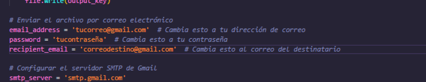

# Wifi extract

<p align="center">

</p>

Este script te permitira extraer las contraseñas de todas las redes wifi que nos hemos conectado y enviar por correo electronico.


### USO:

Después de descargar el repositorio tenemos que editar el script en python y poner tu correo y contraseña para poder recibir los datos

<p align="center">

</p>

Luego de esto deberas convertir el script en **.py** a **.exe** con **auto-py-to-exe**.

```
pip install auto-py-to-exe
```

 